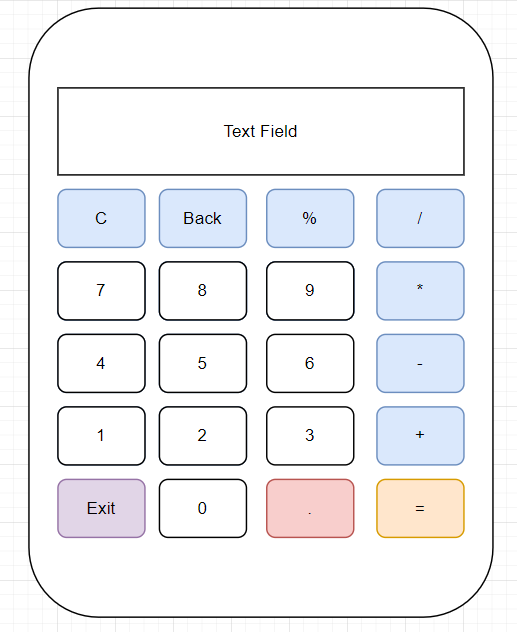

# GUI Calculator
Необхідно розробити python програму калькулятор з графічним інтерфейсом. Графічний інтерфейс має імплементувати UI відповідно до 
вайрфрейму, що приложений до завдання. При натисканню на будь яку кнопку з операцією, програма має додавати операцію в тексове поле,
все як в звичайному калькуляторі.

## Wireframe

## Аргументи Запуску

* Програма має стартувати з консолі `python calculator.py`

## Вимоги до програми
* При помилці - наприклад діленні на 0, програма має показувати помилку на новому віконці (пуш-ап) вікно
яке буде вказувати на тип помилки
* Програма має імплементувати операції введені в текст-філд
* Кожна додана операція має додаватися в текст філд

## Флоу роботи з програмою

* Програма має запуститися з консолі `python calculator.py`
* Далі користувач має вводити необхідно операцію користуючись кнопками
* При натисканні на кнопку '=', текст філд має показувати результат введеної математичної операції
* При натисканні на кнопку 'exit', програма має закритися

## Умови до імплементації

* Цей проект має використовавти бібліотеку роботи з графічним інтерфейсом, детальніше в рекомендаціях
* Проект може бути виконаний як в ООП так і в функціональному стилі
* При виконанні цієї програми, краще користуватися будь-якими тестами, для перевірки того що функції будуть виконуватися
* За тести буде додано бали
* Як порада - до кожної кнопки, має бути імплементована окрема функція

## Рекомендації з приводу бібліотек
* Вам необхідно користуватися будь-якою з бібліотек, що імплементують роботу з графічним інтерфейсом. Ви можете користуватися
`pyqt`, `kivy`, `tkinter`. Найпростіша в імплементації - `tkinter`, раджу користуватися нею, [документація](https://docs.python.org/3/library/tkinter.html)
