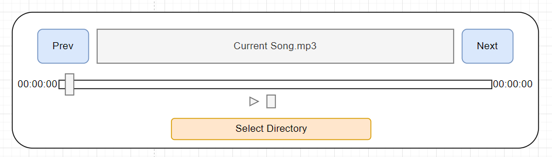

# GUI Audio Player
Необхідно розробити python програму аудіо плеєр з графічним інтерфейсом. Програма має імплементувати UI
відповідно до заданого вайрфрейму. Плеєр має імплементувати вибір директорії з музикою, кнопку наступне аудіо, попереднє аудіо
кнопки контролю програваємого аудіо, та, власне, програвати заданий аудіо файл.

## Wireframe

## Аргументи Запуску

* Програма має стартувати з консолі `python player.py`

## Вимоги до програми
* Коли користувач нажимає на кнопку `Select Directory` - програма має відкрити файловий діалог провідника, та обрати папку
* Якщо в папці немає `mp3` \ `.wav` файлів, текстове поле має відображати надпис `No Sound To Play`
* Якщо в папці є аудіо файли, ви маєте отримати весь список файлів, які співпадають з умовами до звуку, програма має
завантажити цей звук в віджет аудіо, кнопка `Play` має звук аудіо, кнопка `Stop` має зупиняти програвання. Також користувач
має мати змогу прокручувати файл за допомогою слайдера
* Кнопки `Next` та `Prev` мають імплементувати програвання наступного файлу та попереднього файлу.

## Флоу роботи з програмою

* Програма має запуститися з консолі `python player.py`
* Далі користувач має користуватися кнопками відповідно до опису

## Умови до імплементації

* Цей проект має використовавти бібліотеку роботи з графічним інтерфейсом, детальніше в рекомендаціях
* Проект може бути виконаний як в ООП так і в функціональному стилі
* Як порада - до кожної кнопки, має бути імплементована окрема функція

## Рекомендації з приводу бібліотек
* Вам необхідно користуватися будь-якою з бібліотек, що імплементують роботу з графічним інтерфейсом. Ви можете користуватися
`pyqt`, `kivy`, `tkinter`. Найпростіша в імплементації - `tkinter`, раджу користуватися нею, [документація](https://docs.python.org/3/library/tkinter.html)
* Для віджету програвання звуку можна користуватись бібліотекою `playsound`
